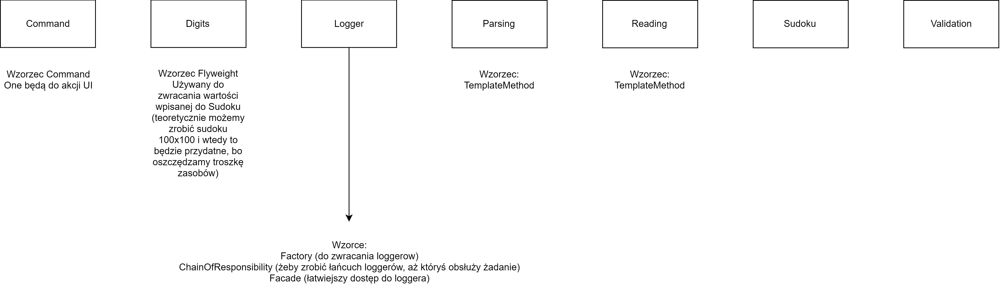

# SudokuSolver

## Overview
Application created by **Daniel Dobrowolski** And **Tomasz Janik** using C#.

User interface was created using WPF.

Image processing and digit recognition was created using EmguCV.
 
This application allows to input sudoku from either .txt file or image and display it on UI, after that it allows user to edit the sudoku and then solve it using two different techniques.   

## Used design patterns
* Command
* Factory
* Chain of Responsibility
* Facade
* Singleton
* Template Method
* Strategy
* Memento
* Abstract Factory
* Dependency Injection
* MVVM
* Builder
* Iterator
* Observer

### Command
Used in ViewModel of MVVM as a way to create responsive design - when user clicks on button corresponding action is executed.

We have 4 concrete commands that on execute carry through one of following actions:
* Clearing Board
* Loading Sudoku
* Solving Sudoku
* Undoing previous move 

### Factory
Used as a way to get one of two possible solving strategies - it is quite easy to add new solving strategies and all id requires is to write said strategy and then add it to StrategyFactory .

This factory depending on string return matching SolvingStrategy - it makes code more readable. 

By using map of string to ISolvingStrategy we were able to remove if/switch statements.

### Chain of Responsibility
Used to create chain of loggers with different behaviour depending on LogLevel - replaces a lot of if - else and makes the code more readable

We have two types of loggers with some subtypes:
* Console Logger
    * Debug
    * Info
    * Error
* File Logger

and after logging the message the corresponding logger is chosen depending on LogLevel.

### Facade
Used to make logging little easier to be inserted and used in code.

It allows to change path where file loges are changed with only one function and it has predefined functions for each LogLevel (debug, info, warning, error)

On top of that it inits whole loggers chain of responsibility.

### Singleton
We have only one instance of logger for whole application, so it is a singleton class, because there is no need to have multiple loggers with our implementation.

 We also use singleton instance of class used to recognise and parse convex hull into rectangle (used in dependency injection process - same as multiple other classes).
 
 ### Template Method
 Used to join validation and parsing (also validation and reading) together - it defines skeleton of algorithm in an operation.
 
 Allows us to easily change some steps of algorithm and only these steps exactly. Also because we used it - we can quite easily add more methods to validate and read another file format.
 
 ### Strategy
We have two strategies to solve sudoku, but in future releases we might want add more strategies to it's quite important to have easy way of implementing them.

This approach allows us to split implementation of strategy from command that is executed on 'Solve' click .

On top of that we use a lot of strategies to implement some image processing function, because there are a lot of ways to achieve what we want and if we found better approach we can easily replace currently used algorithm or give user option to choose for themselves. For example we can recognise numbers using SVM or ML.Net

### Memento
It allows us to implement undo button and logic behind it - we store previous cell state and we can easily restore it if user decides to do so.

### Abstract Factory
As mentioned before we have different kind of loggers - console and file logger. And there might someday come a day where we need to add some kind of logger that needs to sends message to our internet sever in order to make error detection for us easier.

Because of that we implemented abstract factory which allows us to create different kinds of loggers factories.. 
 
 ### Dependency Injection
 We use dependency injection through most of the classes - it allows us to increase readability and code reuse, realisation of Inversion Of Control.
 
 It also allows us to make testing of our code easier, because we can focus only on given class functionality and mock things we need to inject into given class.
 
 ### MVVM
 Pattern used in WPF applications to separate graphical interface from back-end logic. ViewModel in MVVM is used as a value converter responsible for converting data from model to view in such a way that they can be easily displayed (for example binded).
 
 ### Builder
In image recognition there are a lot of parameters that can be changed to make it work worse or better on some examples. We use builders for example to set up digit recognition to make it fast and easy.

We also use builders to build whole Sudoku Graber with initial parameters.

### Iterator
 We use iterator to iterate through sudoku which is 2d array, so iterator makes our code more readable and clean.
 
 ### Observer
 User can update each cell individually by inputting some value and whole board needs to know about it in order to create Memento that can later be used to undo move. 