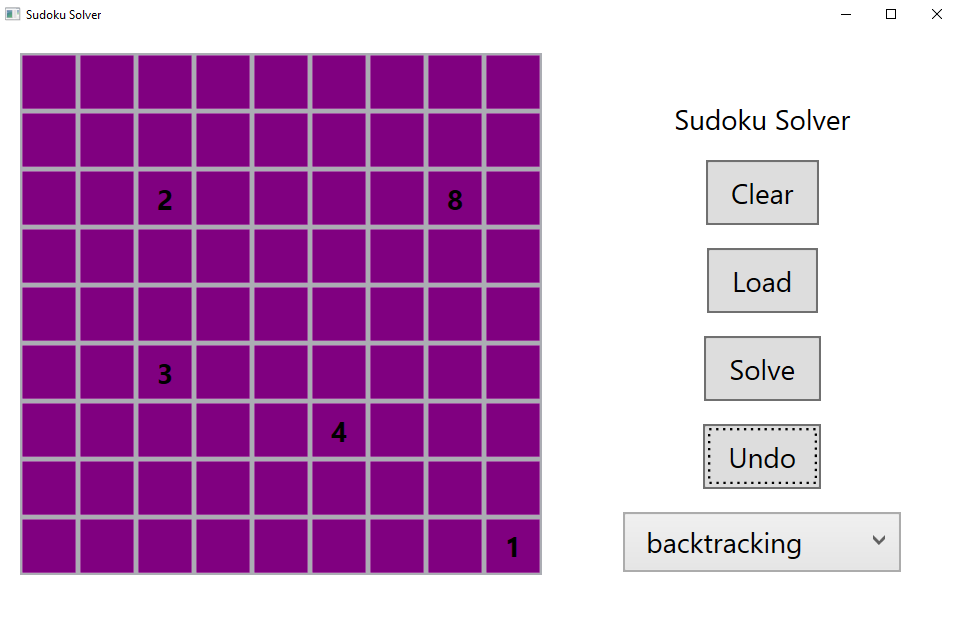

# SudokuSolver

## Todo

#### Unit/Integration tests
#### Add save command

## Todo (c#, not design patterns)
#### Add string localization
#### Make it async

## Used design patterns

#### Command
#### Factory
#### Chain of responsibility
#### Facade
#### Singleton
#### TemplateMethod
#### Strategy
#### Memento
#### AbstractFactory
#### Dependency Injection
#### MVVM
#### Builder
#### Observer - kinda used in memento, just not implemented by us

## Must have design patterns to use

#### Iterator - connection to database ?

## Possible design patterns that could be used

#### Composite ?
#### Prototype ?
#### Visitor ?
#### Flyweight :(